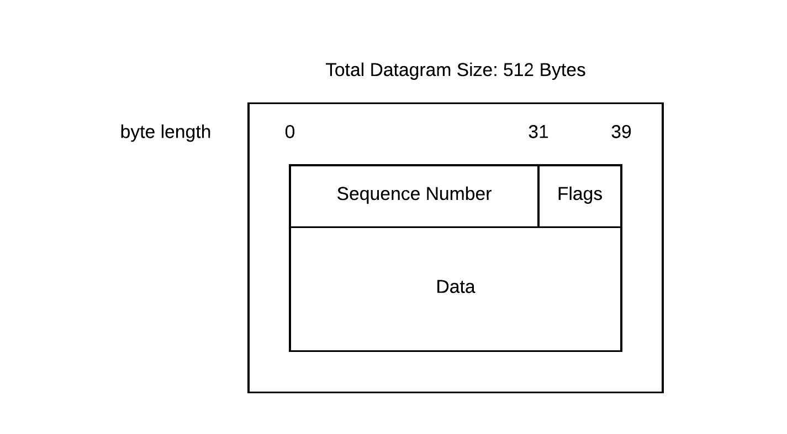
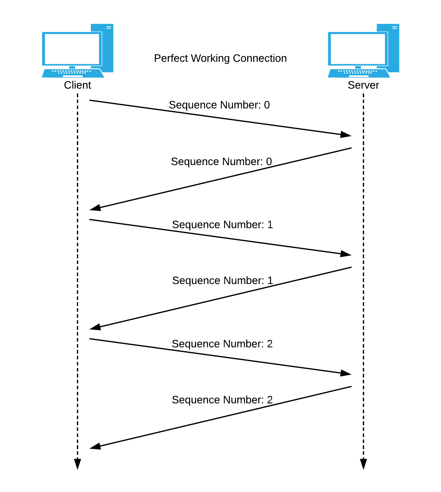
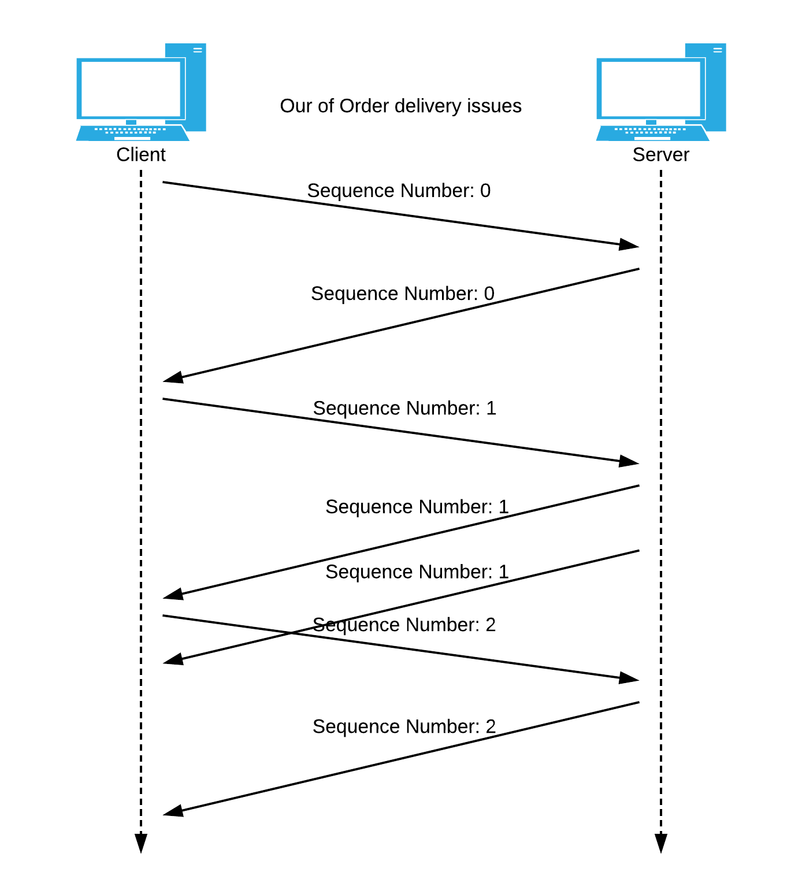
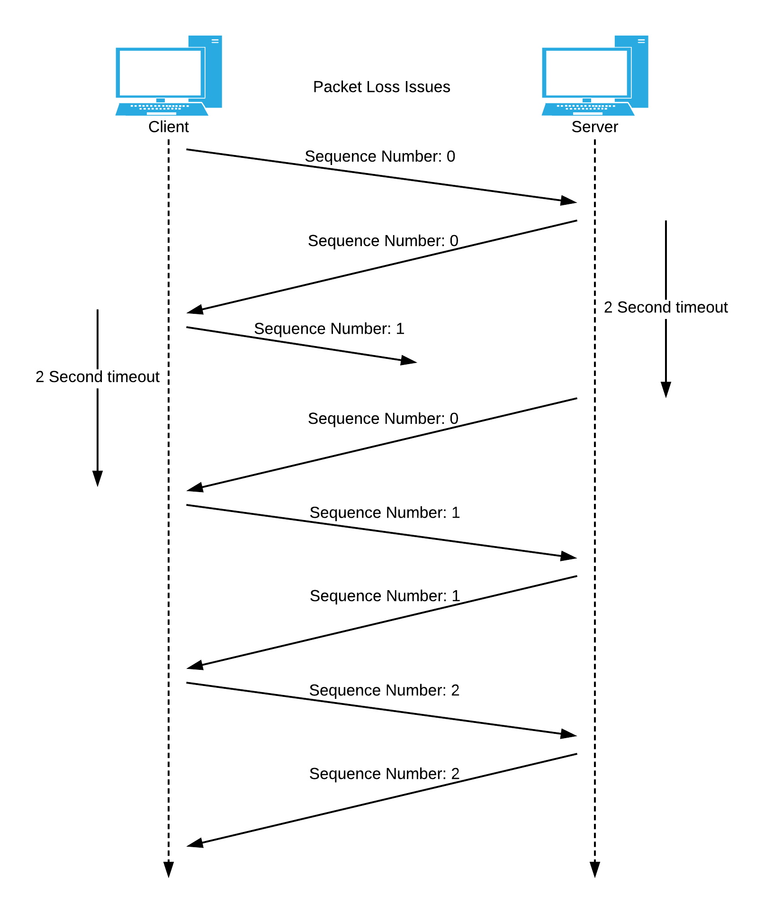

# Reliable File Transfer
The following protocol guarantees reliable, in order data transfer for udp.
## Compiling
Compile All
```
make
```
Compile Server Only
```
make server
```
Compile Client Only
```
make client
```
Remove Previous Compiles
```
make clean
```
## Client
To run the client execute the following command
```
./client <hostname> <port> <file to request> <storage location>
```

## Server
To run the server execute the following command
```
./server 8080
```
## Implementation

### Packet Format
This protocol operates by sending 512 byte packets, 512 bytes being the minimum data size that is guaranteed to be transmittable. Below is an illustration of our packet.


#### Sequence Number
The sequence number takes up the first 4 Bytes of the packet. A sequence number of 0 is reserved for establishing the initial connection. Each packet is assigned a unique sequence number. 
There are a maximum of 4294967295 unique numbers. In our protocol this means we can transmit files of up to size 2.173TB or 1.997 TiB.

#### Flags
The flags take up 1 byte immediately after the sequence number. Currently the only flag is the lsb and is set when the connection is to be terminated.

#### Data
The data takes up the next 506 Bytes. If the sequence number is 0 the content of data is the file the client has requested. 
If the terminate flag is set the contents of data is the reason for termination. Else the contents of data is a 506 byte chunk of the requested file.

### Ideal Operation
Ideal operation is as follows.
 1. Client requests a file.
 2. Client creates a new file at specified location.
   * If no response in 2 seconds, resend request.
   * If no response after 8 tries terminate connection.
 3. Server receives file request.
   * If the requested file does not exist the server sends an error and terminates the connection.
 4. If the servers sequence number is equal to the received sequence number from the client, increment the servers sequence number.
 5. Server encapsulates the sequence numbers chunk of 506 bytes from the requested file.
 6. Server sets the sequence number to one greater than that of the request.
 7. Server sends the packet.
 8. Client receives a packet.
 9. Client checks the sequence number.
   * if the number is 1 greater than the sequence number of the last packet it sent, the clients sequence number is updated to the received sequence number, and the data is put into the clients file.
   * else the packet is ignored, clients sequence number is kept the same.
 10. Client responds with it's sequence number.
 11. Server receives the request. 
 12. Server evaluates the sequence number.
   * If this is not the last sequence number go back to step 4.
   * else continue.
 13. Server sends the terminate connection request ten times.
 14. Client receives the terminate connection flag and terminates.
 15. Server terminates.



### Handling Unconformities
The server does not always behave ideally. Below illustrates how some unconformities are addressed.
#### Requested File Doesnt Exist
If the requested file doesnt exist the following is done.

##### Server
 * Set the terminate flag
 * Put file not found error in data.
 * Send the error ten times.
 * Terminate the connection.

##### Client
 * Received terminate in response to establishing connection.
 * Display error causing failure.

#### Out of Order
If either the client or the server receives an out of order packet, the packet is discarded and responded to with a request for the correct packet.

#### Delay And Packet Loss
If either the client or the server waits for longer than 2 seconds for a response, the last packet sent is resent. If no response happens in 8 times for the handshake or 0xFF for the rest the connection is terminated.
If either the client or the server waits for longer than 2 seconds for a response, the last packet sent is resent. If no response happened 8 times in a row for the handshake of 0xFF for the rest it assumes the connection has been lost and terminates the connection.
